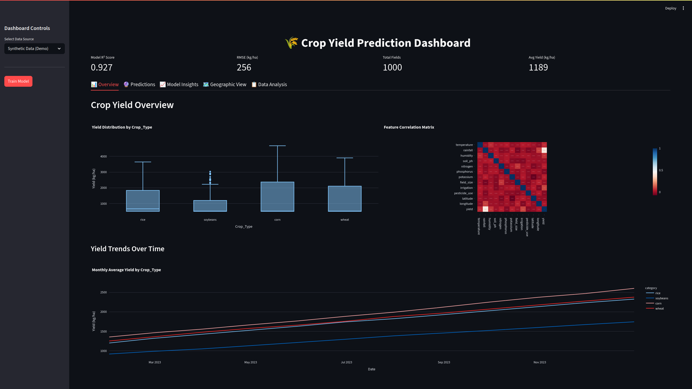

# 🌾 Crop Yield Dashboard

[](https://www.python.org/)
[](https://streamlit.io/)
[](https://xgboost.readthedocs.io/)
[](LICENSE)
[](https://github.com/psf/black)
[](https://github.com/d-dziublenko/crop-yield-dashboard/graphs/commit-activity)

An advanced machine learning dashboard for predicting crop yields using XGBoost, featuring real-time predictions, comprehensive data visualizations, and model interpretability through SHAP analysis. Built with Streamlit for an intuitive, interactive user experience.

<p align="center">
  
</p>

## 🌟 Why This Dashboard?

Agricultural yield prediction is crucial for food security, farm management, and economic planning. This dashboard bridges the gap between complex machine learning models and practical agricultural decision-making by providing:

- **Accurate Predictions**: State-of-the-art XGBoost algorithm with R² scores typically above 0.85
- **Interpretable Results**: Understand exactly why each prediction was made using SHAP analysis
- **Real-time Analysis**: Instant predictions and visualizations as you adjust parameters
- **Geographic Insights**: Visualize yield patterns across different regions
- **Easy Integration**: Simple CSV upload or API access for seamless workflow integration

## ✨ Key Features

### 🤖 Machine Learning Core

- **XGBoost Algorithm**: Gradient boosting for high-accuracy yield predictions
- **Automatic Feature Engineering**: Handles categorical variables and scaling automatically
- **Cross-validation**: Built-in model validation for reliable performance metrics
- **Hyperparameter Optimization**: Pre-tuned parameters with option for custom configuration

### 📊 Interactive Visualizations

- **Dynamic Charts**: Real-time updates using Plotly for smooth interactions
- **Correlation Analysis**: Understand relationships between environmental factors
- **Yield Distribution**: Box plots and histograms for statistical insights
- **Trend Analysis**: Time series visualizations for seasonal patterns

### 🔍 Model Interpretability

- **SHAP Integration**: Feature importance for both global model and individual predictions
- **Waterfall Charts**: Visual breakdown of how each factor contributes to predictions
- **Partial Dependence Plots**: See how individual features affect yield outcomes
- **Feature Interaction Analysis**: Understand complex relationships between variables

### 🗺️ Geographic Analysis

- **Interactive Maps**: Folium integration for spatial yield visualization
- **Regional Statistics**: Compare performance across different geographic areas
- **Heatmap Overlays**: Identify high and low yield zones
- **Custom Markers**: Detailed information for each field location

### 📈 Data Management

- **Multiple Input Methods**: Synthetic data generation, CSV upload, or database connection
- **Data Validation**: Automatic checking for required columns and data quality
- **Export Capabilities**: Download predictions and analysis results
- **Data Preprocessing**: Built-in handling of missing values and outliers

## 🚀 Quick Start

### Prerequisites

Before you begin, ensure you have the following installed:

- Python 3.8 or higher ([Download Python](https://www.python.org/downloads/))
- pip package manager (comes with Python)
- Git for version control ([Download Git](https://git-scm.com/))

### Installation in 3 Steps

1. **Clone the repository**

   ```bash
   git clone https://github.com/d-dziublenko/crop-yield-dashboard.git
   cd crop-yield-dashboard
   ```

2. **Set up virtual environment** (recommended for isolated dependencies)

   ```bash
   # Create virtual environment
   python -m venv venv

   # Activate it
   # On Windows:
   venv\Scripts\activate
   # On macOS/Linux:
   source venv/bin/activate
   ```

3. **Install dependencies and run**
   ```bash
   pip install -r requirements.txt
   streamlit run crop_yield_dashboard.py
   ```

The dashboard will automatically open in your browser at `http://localhost:8501` 🎉

## 📖 Detailed Usage Guide

### 1. Loading Your Data

The dashboard accepts data in three ways:

#### Option A: Demo Mode (Synthetic Data)

Perfect for exploring features without your own data:

1. Select "Synthetic Data (Demo)" from the sidebar
2. Click "Train Model"
3. Explore all features with generated agricultural data

#### Option B: Upload Your CSV

For using your own agricultural data:

1. Select "Upload CSV" from the sidebar
2. Click "Choose a CSV file" and select your prepared data
3. Review the data preview to ensure correct loading
4. Click "Train Model" to begin analysis

#### Option C: Database Connection (Coming Soon)

Direct connection to your agricultural database for real-time analysis

### 2. Understanding Your Data Format

Your CSV file should include these columns:

| Column Name     | Type   | Description                             | Valid Range                 | Unit     |
| --------------- | ------ | --------------------------------------- | --------------------------- | -------- |
| `temperature`   | float  | Average growing season temperature      | 10-40                       | °C       |
| `rainfall`      | float  | Monthly rainfall amount                 | 0-300                       | mm       |
| `humidity`      | float  | Average relative humidity               | 20-95                       | %        |
| `soil_ph`       | float  | Soil pH level                           | 4.5-8.5                     | pH       |
| `nitrogen`      | float  | Soil nitrogen content                   | 10-80                       | kg/ha    |
| `phosphorus`    | float  | Soil phosphorus content                 | 10-60                       | kg/ha    |
| `potassium`     | float  | Soil potassium content                  | 10-70                       | kg/ha    |
| `crop_type`     | string | Type of crop grown                      | wheat, corn, rice, soybeans | -        |
| `field_size`    | float  | Size of the field                       | 1-50                        | hectares |
| `irrigation`    | int    | Irrigation availability                 | 0 or 1                      | binary   |
| `pesticide_use` | float  | Amount of pesticide used                | 0-5                         | kg/ha    |
| `yield`         | float  | **Target variable** - Actual crop yield | 500-8000                    | kg/ha    |

**Optional columns for geographic features:**

- `latitude`: float (for map visualization)
- `longitude`: float (for map visualization)

### 3. Making Predictions

Once your model is trained:

1. Navigate to the **"🔮 Predictions"** tab
2. Adjust the input parameters using the intuitive controls:
   - Use sliders for continuous values (temperature, rainfall, etc.)
   - Select from dropdowns for categorical values (crop type, irrigation)
   - Enter precise values using number inputs where needed
3. Click **"Predict Yield"** to get instant results
4. Review the prediction explanation showing which factors contributed most

### 4. Analyzing Results

The dashboard provides five comprehensive analysis tabs:

#### 📊 Overview Tab

- Yield distribution across different crop types
- Feature correlation heatmap
- Time series trend analysis
- Key performance metrics

#### 🔮 Predictions Tab

- Interactive prediction interface
- Real-time SHAP explanations
- Waterfall charts for factor contributions
- Confidence intervals for predictions

#### 📈 Model Insights Tab

- Global feature importance rankings
- SHAP summary plots for all features
- Partial dependence plots for selected variables
- Model performance metrics (R², RMSE)

#### 🗺️ Geographic View Tab

- Interactive map with yield markers
- Regional yield comparisons
- Spatial pattern identification
- Location-based filtering

#### 📋 Data Analysis Tab

- Comprehensive data statistics
- Data quality assessment
- Distribution visualizations
- Export functionality for results

## 🔧 Configuration

### Model Parameters

The default XGBoost configuration can be customized in `config/config.yaml`:

```yaml
model:
  hyperparameters:
    n_estimators: 100 # Number of trees
    max_depth: 6 # Maximum tree depth
    learning_rate: 0.1 # Step size shrinkage
    subsample: 0.8 # Subsample ratio of training data
    random_state: 42 # For reproducibility
```

### Visualization Settings

Customize the appearance and behavior:

```yaml
visualization:
  map:
    default_zoom: 5 # Initial map zoom level
    max_markers: 200 # Maximum markers to display
  charts:
    color_scheme: "plotly" # Color palette
    height: 400 # Chart height in pixels
    width: 700 # Chart width in pixels
```

## 🐳 Docker Deployment

For containerized deployment:

```bash
# Build the Docker image
docker build -t crop-yield-dashboard .

# Run the container
docker run -p 8501:8501 crop-yield-dashboard

# Or use docker-compose for easier management
docker-compose up
```

Access the dashboard at `http://localhost:8501`

## 🧪 Testing

Run the comprehensive test suite:

```bash
# Run all tests
pytest tests/

# Run with coverage report
pytest tests/ --cov=crop_yield_dashboard --cov-report=html

# Run specific test file
pytest tests/test_model.py -v
```

## 🚀 Deployment Options

### Streamlit Cloud (Recommended for demos)

1. Fork this repository
2. Sign up at [share.streamlit.io](https://share.streamlit.io)
3. Connect your GitHub repository
4. Deploy with one click

### Heroku

```bash
# Install Heroku CLI and login
heroku create your-app-name
git push heroku main
```

### AWS EC2 / Google Cloud / Azure

Use the provided Docker image for easy deployment on any cloud platform

## 📊 Performance Benchmarks

Typical performance metrics on standard agricultural datasets:

- **Model Training Time**: 5-30 seconds for 1,000-10,000 samples
- **Prediction Speed**: <100ms per prediction
- **Model Accuracy**: R² score typically 0.75-0.90
- **Memory Usage**: ~500MB for typical datasets

## 🤝 Contributing

I welcome contributions! Here's how you can help:

1. **Fork the repository** and create your branch:

   ```bash
   git checkout -b feature/AmazingFeature
   ```

2. **Make your changes** and commit:

   ```bash
   git commit -m 'Add some AmazingFeature'
   ```

3. **Push to your branch**:

   ```bash
   git push origin feature/AmazingFeature
   ```

4. **Open a Pull Request** with a comprehensive description

See [CONTRIBUTING.md](CONTRIBUTING.md) for detailed guidelines.

## 📚 Documentation

- [Installation Guide](docs/installation.md) - Detailed setup instructions
- [Usage Guide](docs/usage.md) - Comprehensive feature walkthrough
- [API Reference](docs/api_reference.md) - For programmatic access
- [FAQ](docs/faq.md) - Common questions and troubleshooting

## 🛣️ Roadmap

### Version 2.0 (Q2 2024)

- [ ] Real-time weather API integration
- [ ] Multi-crop simultaneous predictions
- [ ] Mobile responsive design
- [ ] Batch prediction processing

### Version 3.0 (Q4 2024)

- [ ] Satellite imagery integration
- [ ] Climate change scenario modeling
- [ ] Recommendation engine for optimal planting
- [ ] Multi-language support

## 📄 License

This project is licensed under the MIT License - see the [LICENSE](LICENSE) file for details.

## 🙏 Acknowledgments

This project leverages several outstanding open-source libraries:

- [Streamlit](https://streamlit.io/) - The amazing framework that powers our dashboard
- [XGBoost](https://xgboost.readthedocs.io/) - For state-of-the-art gradient boosting
- [SHAP](https://github.com/slundberg/shap) - For model interpretability
- [Plotly](https://plotly.com/) - For interactive visualizations
- [Folium](https://python-folium.readthedocs.io/) - For geographic mapping

Special thanks to the agricultural data science community for inspiration and feedback.

## 📧 Contact & Support

- **Project Maintainer**: [Dmytro Dziublenko](d.dziublenko@gmail.com)
- **Issues**: [GitHub Issues](https://github.com/d-dziublenko/crop-yield-dashboard/issues)
- **Discussions**: [GitHub Discussions](https://github.com/d-dziublenko/crop-yield-dashboard/discussions)

---

<p align="center">
  Made with ❤️ for sustainable agriculture
  <br>
  <a href="https://github.com/d-dziublenko/crop-yield-dashboard">⭐ Star me on GitHub!</a>
</p>
